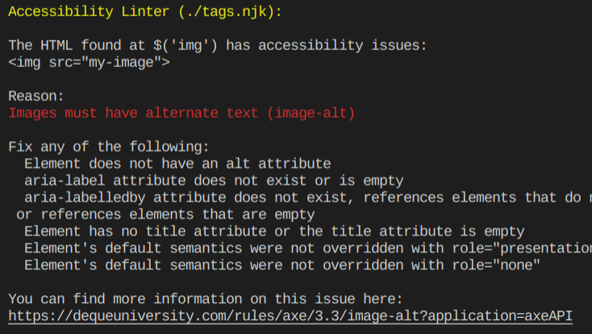

# eleventy-plugin-accessibility

An [Eleventy](https://github.com/11ty/eleventy) plugin to check for accessibility issues in HTML using axe.



## Installation

This is an alpha package so it is not on npm yet, but you can try it out by installing it directly from GitHub.

```
npm install --save-dev nickcolley/eleventy-plugin-accessibility
```

Open up your Eleventy config file (probably `.eleventy.js`) and use `addPlugin`.

Only run the plugin in a test environment to avoid slow builds.

```
const accessibilityPlugin = require("eleventy-plugin-accessibility");

module.exports = function(eleventyConfig) {
  if (process.env.NODE_ENV === "test") {
    eleventyConfig.addPlugin(accessibilityPlugin);
  }
};
```

In your `package.json` update your tests scripts:

```json
{
    "scripts": {
        "test": "NODE_ENV=test eleventy 2>&1 | tee -a /tmp/ci-output.txt; if grep -Fq 'Linter' /tmp/ci-output.txt; then exit 1; fi"
    }
}
```

At the moment [Eleventy linters do not fail the build](https://github.com/11ty/eleventy/issues/673) which is why this is needed.


## Running it


To only run this in

Read more about [Eleventy plugins.](https://www.11ty.io/docs/plugins/)
